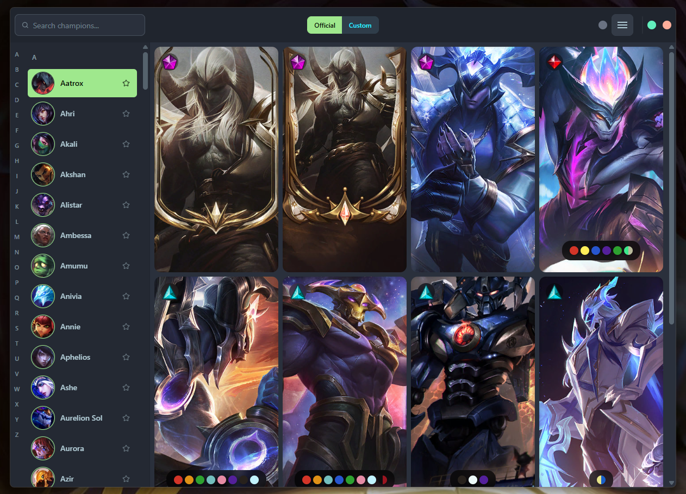

  
  <h1>Chaos - League of Legends Skin Manager</h1>
  
<em>Empowering League of Legends customization since 2024</em>

> **Note**: This repository contains the open-source components and development setup for Chaos. The full application and source code are available through our official distribution channels.

## What is Chaos?

Chaos is a premium League of Legends skin management application that revolutionizes how you customize your gaming experience. Built with cutting-edge technology, Chaos provides a seamless, powerful, and user-friendly platform for managing all your League of Legends skins, custom content, and game modifications.

## Application Preview

  
  
<em>Chaos interface showcasing champion management and skin browsing</em>

## Key Features

### Comprehensive Skin Management
- **Complete Champion Database**: Access every champion and skin in League of Legends
- **Real-time Updates**: Automatic synchronization with the latest game patches
- **Advanced Filtering**: Find exactly what you're looking for with intelligent search and categorization
- **Skin Preview**: See how skins look before applying them
- **Favorites System**: Organize your preferred skins for quick access

### Custom Content Support
- **Custom Skin Import**: Import and manage your own custom skins and chromas
- **Custom Map Integration**: Support for custom map modifications and themes
- **Content Validation**: Automatic verification of custom content compatibility
- **Easy Management**: Simple drag-and-drop interface for organizing custom content

### Party Mode & Collaboration
- **Multi-user Support**: Collaborate with friends on skin management
- **Shared Libraries**: Create and share skin collections with your team
- **Real-time Sync**: See changes made by other users instantly
- **Permission Management**: Control who can modify shared content

### Game Integration
- **Seamless Operation**: Works directly with League of Legends client
- **Automatic Detection**: Automatically finds and connects to your game installation
- **Safe Injection**: Secure DLL injection for skin modifications
- **Performance Optimized**: Minimal impact on game performance

### Modern User Interface
- **Beautiful Design**: Clean, modern interface with theme support
- **Responsive Layout**: Optimized for all screen sizes and resolutions
- **Intuitive Navigation**: Easy-to-use interface that requires no technical knowledge
- **Accessibility**: Designed with accessibility in mind for all users

### Advanced Features
- **Discord Integration**: Rich presence and social features
- **Offline Capability**: Works without internet connection
- **Backup & Restore**: Safely backup and restore your customizations
- **Performance Monitoring**: Track and optimize application performance

## How It Works

### Installation & Setup
1. **Download**: Get Chaos from our official distribution channels
2. **Install**: Simple one-click installation process
3. **Configure**: Point to your League of Legends installation
4. **Launch**: Start managing your skins immediately

### Skin Management Process
1. **Browse**: Explore the complete collection of official and custom skins
2. **Select**: Choose the skins you want to use
3. **Apply**: One-click application to your game
4. **Enjoy**: Experience your customized League of Legends

### Custom Content Creation
1. **Import**: Add your custom skins and modifications
2. **Organize**: Categorize and tag your content
3. **Share**: Distribute your creations with the community
4. **Update**: Keep your content current with game patches

## Safety & Security

- **VAC Safe**: Designed to work with Vanguard Anti-Cheat systems
- **Riot Compliant**: Follows Riot Games terms of service
- **Secure Injection**: Safe DLL injection methods
- **No Malware**: Clean, verified code with no malicious components
- **Regular Updates**: Continuous security improvements and patches

## Community & Support

- **Active Community**: Join thousands of users in our community
- **Expert Support**: Professional support team for all your questions
- **Regular Updates**: New features and improvements every month
- **Documentation**: Comprehensive guides and tutorials
- **Discord Server**: Real-time community interaction and support

## Pricing & Availability

Chaos is available as a premium application with different licensing options:

- **Standard License**: Full access to all features
- **Pro License**: Advanced features and priority support
- **Enterprise License**: Team management and advanced collaboration tools

Contact us for pricing information and licensing options.

## Why Choose Chaos?

### Professional Quality
- Built by experienced developers with years of League of Legends modding experience
- Enterprise-grade code quality and reliability
- Continuous development and improvement

### User Experience
- Designed for both beginners and advanced users
- Intuitive interface that requires no technical knowledge
- Comprehensive help system and tutorials

### Performance
- Optimized for minimal impact on game performance
- Efficient memory and CPU usage
- Fast loading and smooth operation

### Support
- Professional support team
- Active community of users
- Regular updates and new features

## Screenshots & Demos

*[Screenshots and demo videos will be added here]*

## Testimonials

*"Chaos has completely transformed how I play League of Legends. The interface is intuitive, the features are powerful, and the support is outstanding."* - Professional Player

*"As a content creator, Chaos gives me everything I need to showcase custom skins and help my community."* - Content Creator

*"The party mode feature is incredible for our team. We can all coordinate our skins and create amazing content together."* - Team Manager

## Contact & Support

- **Website**: [https://bynw.xyz/](https://bynw.xyz/)
- **Discord**: [https://discord.gg/8HZNrYbaAC](https://discord.gg/8HZNrYbaAC)
- **Email**: [8v0ky0@gmail.com](mailto:8v0ky0@gmail.com)
- **Documentation**: [README.md](README.md)
- **Support**: [GitHub Issues](https://github.com/bynwkyow/chaos-skin-manager/issues)

## Legal Information

- **Terms of Service**: [Terms]
- **Privacy Policy**: [Privacy]
- **License Agreement**: [License]
- **Riot Games Compliance**: [Compliance Statement]

---

  
Made with ❤️ by bynwkyow

  
<em>Empowering League of Legends customization since 2024</em>

